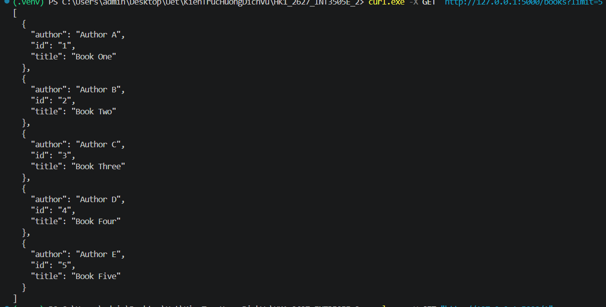
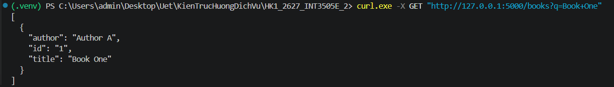
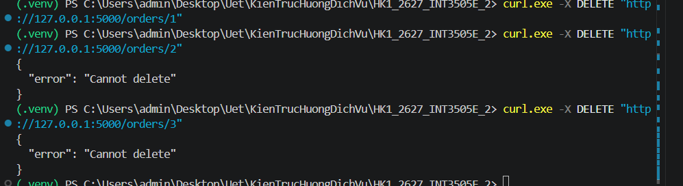
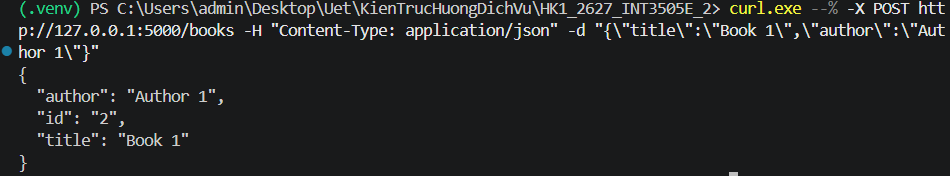
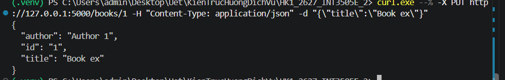
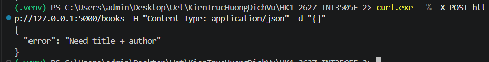
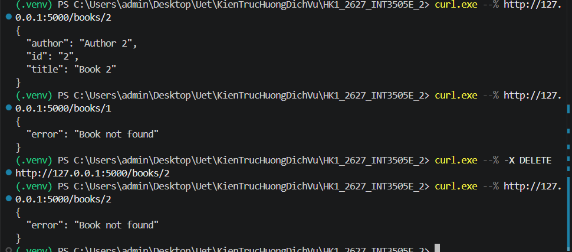

# Lab 1: Nhập môn Xây dựng RESTful API với Flask

Thực hành các khái niệm cơ bản về RESTful API, định tuyến (Routing), phương thức HTTP (GET, POST, PUT, DELETE), mã trạng thái HTTP (Status Codes) và xử lý dữ liệu JSON trong Flask.

---

## Danh sách các bài thực hành

### 1. Bài 1: Endpoint khởi tạo (`GET /`)
- **Tập tin**: [`appB1.py`](./appB1.py)
- **Mô tả**: Tạo ứng dụng Flask cơ bản, định nghĩa endpoint gốc trả về thông điệp chào mừng dạng JSON.
- **Endpoint**: `GET /`
- **Kết quả thực thi**:
  
  

---

### 2. Bài 2: Kiểm tra trạng thái (`health`) và phản hồi dữ liệu (`echo`)
- **Tập tin**: [`appB2.py`](./appB2.py)
- **Mô tả**:
  - `GET /health`: Trả về trạng thái hoạt động của dịch vụ (`{"status": "healthy"}`).
  - `POST /echo`: Nhận payload JSON từ client và phản hồi lại chính dữ liệu đó.
- **Kết quả thực thi**:

  

---

### 3. Bài 3: Quản lý học sinh với UUID và kiểm tra dữ liệu đầu vào
- **Tập tin**: [`appB3.py`](./appB3.py)
- **Mô tả**: Endpoint `POST /students` tạo học sinh mới. Tạo định danh tự động bằng `uuid4()`, kiểm tra bắt buộc phải có trường `name` (nếu thiếu trả về mã lỗi `400 Bad Request`).
- **Kết quả thực thi**:

  

---

### 4. Bài 4: Tìm kiếm và Phân trang giới hạn (`limit` & `q`)
- **Tập tin**: [`appB4.py`](./appB4.py)
- **Mô tả**:
  - `GET /books/<book_id>`: Lấy thông tin cuốn sách cụ thể theo ID.
  - `GET /books`: Tìm kiếm sách theo từ khóa trong tiêu đề (`q`) và giới hạn số lượng kết quả (`limit`).
- **Kết quả thực thi**:

  *Lấy chi tiết một cuốn sách theo ID:*
  

  *Tìm kiếm và giới hạn danh sách:*
  

---

### 5. Bài 5: Xóa đơn hàng và xử lý xung đột nghiệp vụ (`409 Conflict`)
- **Tập tin**: [`appB5.py`](./appB5.py)
- **Mô tả**: Endpoint `DELETE /orders/<id>` xóa đơn hàng. Nếu đơn hàng đã ở trạng thái `shipped` hoặc `delivered`, server từ chối xóa và trả về mã lỗi `409 Conflict`.
- **Kết quả thực thi**:

  

---

### 6. Bài 6: CRUD Sách hoàn chỉnh (Full CRUD API)
- **Tập tin**: [`appB6.py`](./appB6.py)
- **Mô tả**: Triển khai đầy đủ vòng đời quản lý tài nguyên sách:
  - `GET /books`: Danh sách toàn bộ sách.
  - `GET /books/<id>`: Chi tiết sách theo ID.
  - `POST /books`: Thêm sách mới, trả về mã `201 Created` kèm header `Location`.
  - `PUT /books/<id>`: Cập nhật thông tin sách.
  - `DELETE /books/<id>`: Xóa sách khỏi hệ thống, trả về `204 No Content`.
- **Kết quả thực thi**:

  *Thêm sách mới:*
  

  *Xem danh sách sách:*
  

  *Cập nhật sách:*
  

  *Xóa sách:*
  