# Lab 2: Chuẩn hóa RESTful API - CRUD, Phân trang & HATEOAS

Thực hành chuẩn hóa thiết kế RESTful API: xử lý HTTP status codes chuẩn (`200`, `201`, `204`, `400`, `404`, `415`, `422`), phân biệt `PUT` (thay thế toàn bộ) và `PATCH` (cập nhật từng phần), quản lý caching qua header `Cache-Control`, phân trang nâng cao và liên kết điều hướng HATEOAS.

---

## 1. Bài 1: Quản lý danh sách sách và Tạo mới (List & Create)
- **Tập tin**: [`appB1.py`](./appB1.py)
- **Các endpoint chính**:
  - `GET /books`: Liệt kê danh sách sách cùng trường `total`.
  - `POST /books`: Tạo sách mới với định danh tăng tự động `_next_id`, kiểm tra định dạng JSON (`415`) và bắt buộc trường `title`, `author` (`422`). Trả về mã `201 Created` kèm header `Location: /books/<id>`.

### Kết quả thực thi
*1. Gọi danh sách ban đầu khi chưa có sách:*
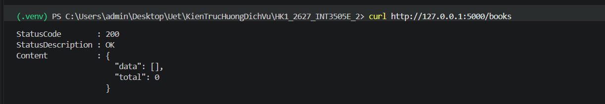

*2. Thêm sách mới thành công (`201 Created`):*
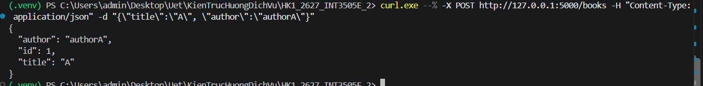

*3. Kiểm tra validation khi thiếu trường bắt buộc (`422 Unprocessable Entity`):*
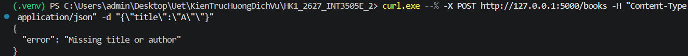

*4. Lấy lại danh sách sau khi thêm:*
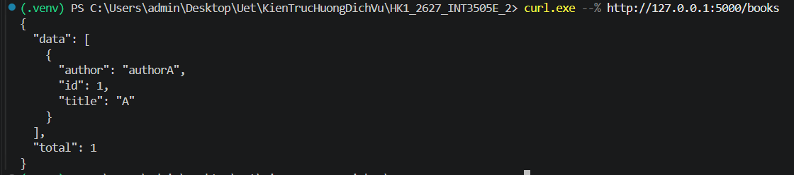

---

## 2. Bài 2: Cập nhật và Xóa Sách (PUT, PATCH, DELETE)
- **Tập tin**: [`appB2.py`](./appB2.py)
- **Các endpoint chính**:
  - `GET /books/<int:book_id>`: Lấy thông tin chi tiết kèm header `Cache-Control: max-age=60`.
  - `PUT /books/<int:book_id>`: **Thay thế toàn bộ** tài nguyên (Full Replacement). Các trường không gửi kèm trong payload sẽ bị gán về `null`.
  - `PATCH /books/<int:book_id>`: **Cập nhật từng phần** (Partial Update). Chỉ thay đổi các trường có trong request body, giữ nguyên các trường khác. Kiểm tra `price >= 0` (`422`).
  - `DELETE /books/<int:book_id>`: Xóa sách khỏi hệ thống và trả về `204 No Content` (không có body).

### Kết quả thực thi
*1. Cập nhật thay thế toàn bộ bằng `PUT` (trường không truyền bị gán `null`):*
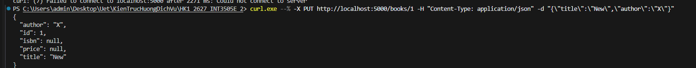

*2. Cập nhật từng phần bằng `PATCH` (chỉ cập nhật trường được chỉ định):*
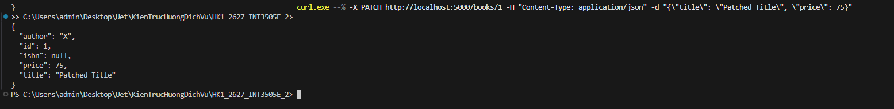

*3. Xóa sách bằng `DELETE` (HTTP `204 NO CONTENT`):*
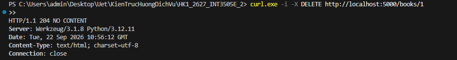

---

## 3. Bài 3: Phân trang nâng cao, Lọc tìm kiếm & HATEOAS Links
- **Tập tin**: [`appB3.py`](./appB3.py)
- **Các tính năng nổi bật**:
  - **Phân trang (Pagination)**: `page` (mặc định 1), `size` (mặc định 20, tối đa 100).
  - **Bộ lọc (Filtering)**: Tìm kiếm gần đúng trong tiêu đề theo `q`, lọc chính xác theo `author`.
  - **Caching**: Thiết lập header `Cache-Control: public, max-age=30`.
  - **HATEOAS Navigation**: Cung cấp liên kết `_links` tự động (`self`, `first`, `last`, `prev`, `next`).

### Kết quả thực thi
*1. Tìm kiếm sách theo từ khóa `q=clean`:*
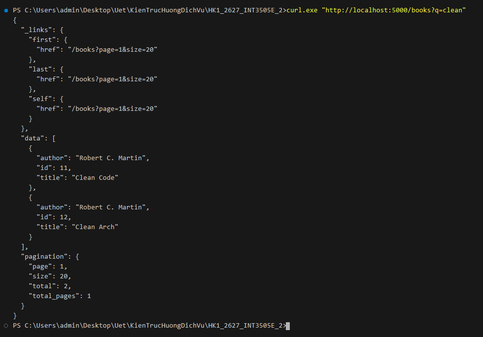

*2. Lọc sách theo tác giả `author=Orwell`:*
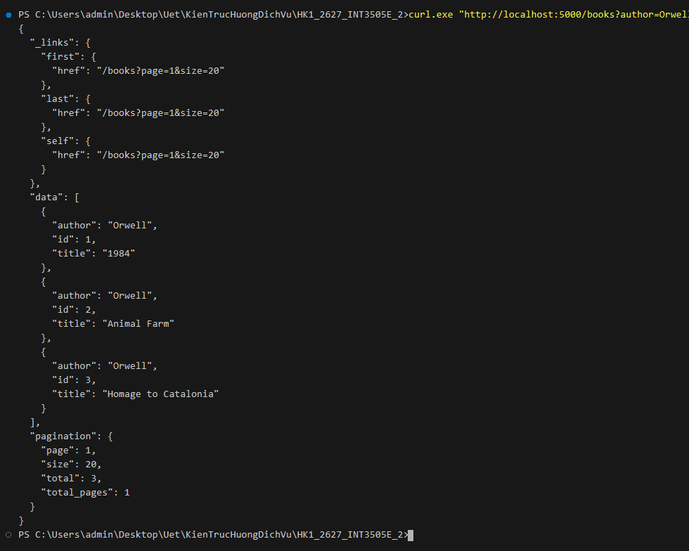

*3. Phân trang tùy chỉnh `page=2&size=10` (hiển thị đầy đủ link `prev`, `next`, `first`, `last`):*
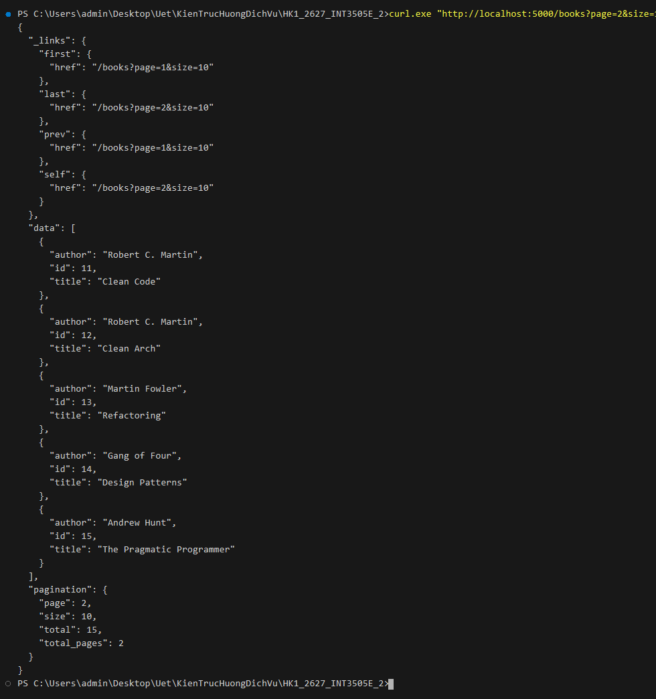

*4. Gọi mặc định kèm header HTTP Cache-Control:*
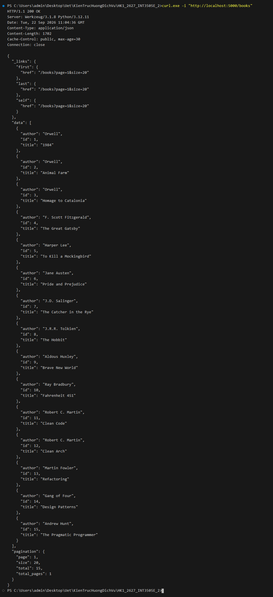
