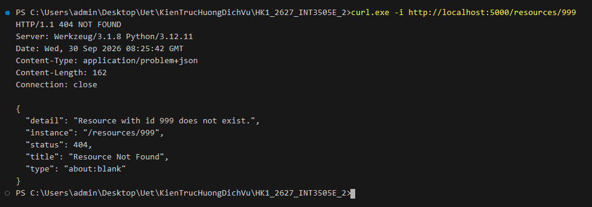
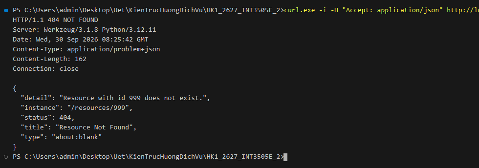
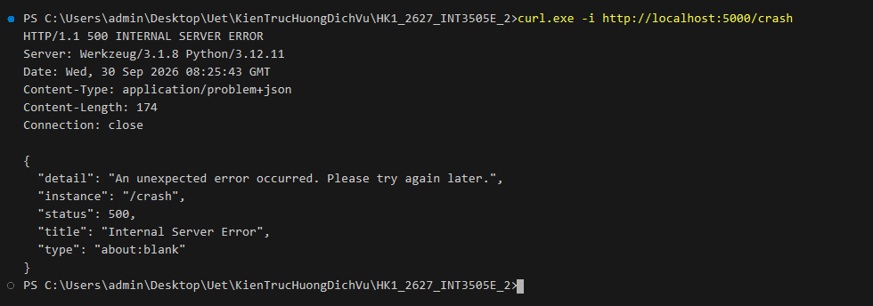
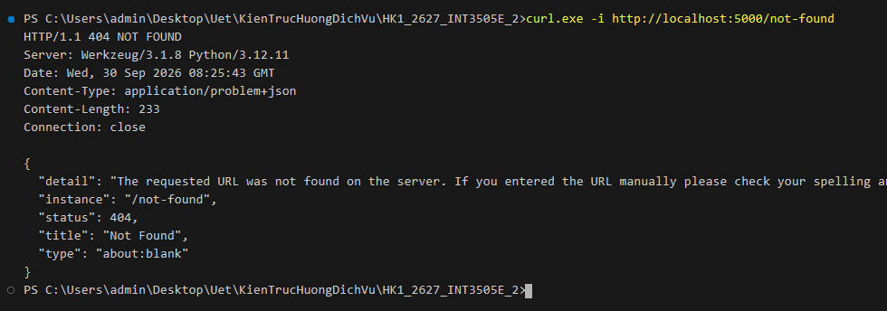

# Lab 3: Thiết kế cấu trúc RESTful API & Chuẩn hóa Error Handler

Thực hành thiết kế kiến trúc RESTful API cho nền tảng Blog, phân loại tài nguyên (Collection, Item, Sub-resource), xây dựng cây endpoint với URI versioning và chuẩn hóa phản hồi lỗi theo đặc tả RFC 7807 (`application/problem+json`).

---

## 1. Bài 1: Thiết kế API Nền tảng Blog đơn giản & Triển khai Collection `/posts`
- **Tập tin**: [`appB1.py`](./appB1.py)

### 1.1. Xác định resources trong miền (Domain Resources)
Dựa vào bài toán thực tế của nền tảng blog, các tài nguyên (resources) cốt lõi bao gồm:
1. **User (`users`)**: Tài khoản người dùng (tác giả viết bài hoặc độc giả tương tác).
2. **Profile (`profiles`)**: Hồ sơ cá nhân của người dùng (tiểu sử/bio, ảnh đại diện/avatar, liên kết,...).
3. **Post (`posts`)**: Bài viết do người dùng đăng tải (tiêu đề, nội dung, tác giả, thẻ,...).
4. **Comment (`comments`)**: Bình luận của người dùng trên bài viết.
5. **Tag (`tags`)**: Thẻ phân loại bài viết theo chủ đề để tìm kiếm và nhóm nội dung.
6. **Follow (`followers` / `following`)**: Mối quan hệ theo dõi giữa người dùng và tác giả khác.

### 1.2. Phân loại Collection / Item / Sub-resource

| Loại tài nguyên | Endpoint URI mẫu | Ý nghĩa / Mô tả |
| :--- | :--- | :--- |
| **Collection** | `/users` | Danh sách toàn bộ tài khoản người dùng |
| **Item** | `/users/{user_id}` | Thông tin chi tiết một tài khoản người dùng |
| **Sub-resource (Item)** | `/users/{user_id}/profile` | Hồ sơ cá nhân của người dùng `{user_id}` |
| **Collection** | `/posts` | Danh sách toàn bộ bài viết |
| **Item** | `/posts/{post_id}` | Chi tiết một bài viết cụ thể |
| **Sub-resource (Collection)** | `/posts/{post_id}/comments` | Danh sách bình luận thuộc bài viết `{post_id}` |
| **Sub-resource (Item)** | `/posts/{post_id}/comments/{comment_id}` | Một bình luận cụ thể của bài viết `{post_id}` |
| **Collection** | `/tags` | Danh sách toàn bộ các thẻ trong hệ thống |
| **Item** | `/tags/{tag_id}` | Chi tiết một thẻ cụ thể |
| **Sub-resource (Collection)** | `/posts/{post_id}/tags` | Danh sách thẻ gắn vào bài viết `{post_id}` |
| **Sub-resource (Item)** | `/posts/{post_id}/tags/{tag_id}` | Một thẻ cụ thể được gắn vào bài viết `{post_id}` |
| **Sub-resource (Collection)** | `/users/{user_id}/followers` | Danh sách người đang theo dõi tài khoản này |
| **Sub-resource (Collection)** | `/users/{user_id}/following` | Danh sách tài khoản mà user này đang theo dõi |
| **Sub-resource (Item)** | `/users/{user_id}/following/{target_user_id}` | Trạng thái theo dõi giữa `{user_id}` và `{target_user_id}` |

### 1.3. Sơ đồ cây endpoint & Quyết định version segment

- **Quyết định Version Segment**: Sử dụng **URI Path Versioning** với tiền tố `/api/v1` (ví dụ: `/api/v1/posts`) vì tính trực quan, dễ nhận biết phiên bản, hỗ trợ định tuyến API Gateway tốt và dễ kiểm thử qua browser / curl.
- **Sơ đồ cây endpoint (Endpoint Tree)**:

```text
/api/v1
│
├── /users
│   ├── GET                          # Lấy danh sách tài khoản người dùng
│   ├── POST                         # Tạo tài khoản người dùng mới
│   └── /{user_id}
│       ├── GET                      # Lấy thông tin chi tiết một tài khoản người dùng
│       ├── PUT / PATCH              # Cập nhật thông tin tài khoản người dùng
│       ├── DELETE                   # Xóa tài khoản người dùng
│       ├── /profile
│       │   ├── GET                  # Lấy hồ sơ người dùng
│       │   └── PUT / PATCH          # Cập nhật hồ sơ người dùng
│       ├── /followers
│       │   └── GET                  # Lấy danh sách người theo dõi tài khoản này
│       └── /following
│           ├── GET                  # Lấy danh sách tài khoản mà user này đang theo dõi
│           └── /{target_user_id}
│               ├── PUT              # Follow tài khoản này
│               └── DELETE           # Unfollow tài khoản này
│
├── /posts
│   ├── GET                          # Lấy danh sách bài viết
│   ├── POST                         # Đăng bài viết mới
│   └── /{post_id}
│       ├── GET                      # Đọc chi tiết bài viết
│       ├── PUT                      # Cập nhật toàn bộ bài viết
│       ├── PATCH                    # Cập nhật một phần bài viết
│       ├── DELETE                   # Xóa bài viết
│       ├── /comments
│       │   ├── GET                  # Lấy danh sách bình luận của bài viết
│       │   └── POST                 # Thêm bình luận vào bài viết
│       │   └── /{comment_id}
│       │       ├── GET              # Chi tiết một bình luận
│       │       ├── PUT / PATCH      # Chỉnh sửa bình luận
│       │       └── DELETE           # Xóa bình luận
│       └── /tags
│           ├── GET                  # Lấy danh sách thẻ của bài viết
│           ├── POST                 # Gắn thẻ vào bài viết
│           └── /{tag_id}
│               └── DELETE           # Gỡ thẻ khỏi bài viết
│
└── /tags
    ├── GET                          # Lấy danh sách tất cả các thẻ
    ├── POST                         # Tạo thẻ mới
    └── /{tag_id}
        ├── GET                      # Chi tiết thẻ
        ├── PUT / PATCH              # Cập nhật thẻ
        └── DELETE                   # Xóa thẻ
```

### 1.4. Triển khai Flask routes cho collection `/posts`
Các endpoint được cài đặt trong [`appB1.py`](./appB1.py):
- `GET /posts`: Lấy danh sách bài viết (hỗ trợ lọc theo `tag`).
- `POST /posts`: Tạo bài viết mới (`201 Created` kèm header `Location: /posts/<id>`, kiểm tra định dạng JSON `415`, validation thiếu trường `422`).
- `GET /posts/<int:post_id>`: Xem chi tiết một bài viết (`200 OK` hoặc `404 Not Found`).
- `PUT /posts/<int:post_id>`: Cập nhật thay thế toàn bộ bài viết (`200 OK`, `422`, `404`).
- `PATCH /posts/<int:post_id>`: Cập nhật một phần bài viết (`200 OK`, `404`).
- `DELETE /posts/<int:post_id>`: Xóa bài viết (`204 No Content` body rỗng, `404`).

---

## 2. Bài 2: Error Handler trả về Problem Details (RFC 7807 problem+json)
- **Tập tin**: [`appB2.py`](./appB2.py)
- **Mục tiêu**: Viết Flask error handler thống nhất trả về chuẩn `application/problem+json`, kèm exception class tùy biến.
- **Các thành phần cốt lõi**:
  - `ProblemError(Exception)`: Lớp ngoại lệ tùy biến lưu trữ `status`, `title`, `detail`.
  - `@app.errorhandler(ProblemError)`: Xử lý lỗi nghiệp vụ và trả về phản hồi định dạng `application/problem+json`.
  - `@app.errorhandler(HTTPException)`: Fallback handler cho các ngoại lệ chuẩn của Flask/Werkzeug (như 404, 405,...).
  - `@app.errorhandler(Exception)`: Fallback handler cho ngoại lệ 500 chưa được bắt, trả về thông điệp trung tính, bảo mật không lộ stack trace cho client và ghi log chi tiết phía server.

### Kết quả thực thi

*1. Request tới tài nguyên không tồn tại `/resources/999` (HTTP 404 Problem Details):*


*2. Client gửi header `Accept: application/json` vẫn nhận về `application/problem+json`:*


*3. Ngoại lệ server chưa bắt `/crash` trả về HTTP 500 trung tính (không lộ stack trace):*


*4. Fallback handler bắt lỗi HTTPException chuẩn (`/not-found`):*

